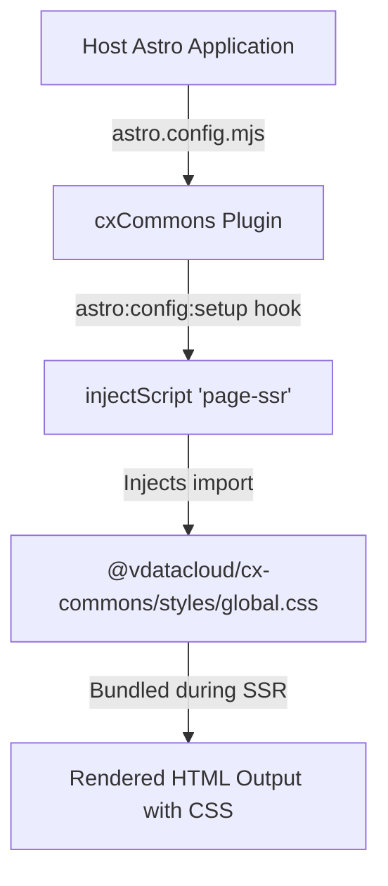

# Architecture & Design System Specification (`cx-platform`)

This document describes the technical architecture, design system token hierarchy, Astro plugin mechanics, and styling conventions enforced by `@vdatacloud/cx-commons`.

---

## 1. Design System Tokens (Data Cloud LNF Scale)

All Data Cloud web applications share a unified design token system defined in `src/styles/global.css`.

### Brand Color Palette (`--color-brand-*`)

| Token | CSS Variable | Hex Equivalent | Usage |
| :--- | :--- | :--- | :--- |
| Brand 50 | `--color-brand-50` | `#eff6ff` | Subtle highlights, active menu item backgrounds |
| Brand 100 | `--color-brand-100` | `#dbeafe` | Hover states, badge backgrounds |
| Brand 400 | `--color-brand-400` | `#60a5fa` | Dark-mode accent text & borders |
| Brand 500 | `--color-brand-500` | `#3b82f6` | Primary action buttons & focus rings |
| Brand 600 | `--color-brand-600` | `#2563eb` | Primary brand accent, active text |
| Brand 700 | `--color-brand-700` | `#1d4ed8` | Hover state for primary buttons |
| Brand 900 | `--color-brand-900` | `#1e3a8a` | Dark container backgrounds |

### Status Color Tokens (`--color-status-*`)

- **Draft:** `--color-status-draft` (`#94a3b8`) — Slate color scale for draft or initial states.
- **Funded:** `--color-status-funded` (`#3b82f6`) — Brand blue color for funded but inactive escrows.
- **Active:** `--color-status-active` (`#10b981`) — Green color for active escrows, active milestones.
- **Proposed:** `--color-status-proposed` (`#f59e0b`) — Amber color for settlement proposals.
- **Disputed:** `--color-status-disputed` (`#f43f5e`) — Red color for active dispute adjudications.
- **Settled:** `--color-status-settled` (`#a855f7`) — Purple color for settled/closed escrows.
- **Fiat Pending:** `--color-status-fiat-pending` (`#6366f1`) — Indigo color for pending off-ledger bank settlement.

---

## 2. Utility Classes & Glassmorphism

`global.css` exports curated utility classes:

```css
/* Glassmorphic Navigation Bar */
.glass-nav {
  background: rgba(255, 255, 255, 0.85);
  backdrop-filter: blur(12px);
  border-bottom: 1px solid rgba(226, 232, 240, 0.8);
}
.dark .glass-nav {
  background: rgba(15, 23, 42, 0.85);
  border-bottom: 1px solid rgba(30, 41, 59, 0.8);
}

/* Glassmorphic Card Container */
.glass-card {
  background: rgba(255, 255, 255, 0.7);
  backdrop-filter: blur(8px);
  border: 1px solid rgba(226, 232, 240, 0.6);
  box-shadow: 0 4px 6px -1px rgba(0, 0, 0, 0.05);
}
.dark .glass-card {
  background: rgba(30, 41, 59, 0.7);
  border: 1px solid rgba(51, 65, 85, 0.6);
  box-shadow: 0 4px 6px -1px rgba(0, 0, 0, 0.3);
}
```

---

## 3. Astro Integration Plugin Mechanics

The core entry point `index.ts` exports `cxCommons()`, an Astro Integration factory function.

### Plugin Lifecycle Flow



### Source Code (`index.ts`)

```typescript
import type { AstroIntegration } from 'astro';

export default function cxCommons(): AstroIntegration {
  return {
    name: '@vdatacloud/cx-commons',
    hooks: {
      'astro:config:setup': ({ injectScript }) => {
        injectScript(
          'page-ssr',
          `import "@vdatacloud/cx-commons/styles/global.css";`
        );
      },
    },
  };
}
```

This guarantees zero-configuration CSS injection for any Astro page or layout.

---

## 4. Zero JS Policy & Theme Persistence

In alignment with Astro's zero-JS philosophy:

- Layout components (`Nav`, `Footer`) emit zero client-side JavaScript by default.
- Interactive features (e.g. dark mode toggle in `Nav.astro`) utilize inline `<script>` tags that execute vanilla DOM manipulations without heavy client-side framework runtime overhead.
- Theme selection (`light` / `dark`) is persisted in `localStorage` under the key `'theme'` and synchronized with the root `<html>` element class list (`class="dark"`).
